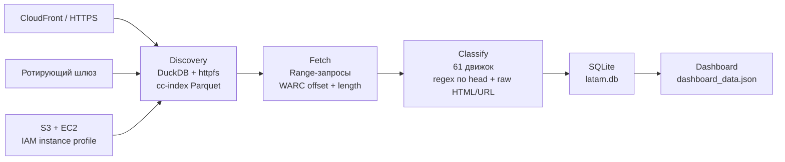

# cc-links — технический обзор

Пайплайн исследует Common Crawl без Athena: находит страницы через колоночный
`cc-index`, забирает только нужные WARC-фрагменты, определяет движок сайта и
сохраняет результат в SQLite для аналитики и дашборда.



## Quickstart

Установка:

```bash
pip install -r requirements.txt
```

Логи используют стандартный `logging`. Уровень по умолчанию — `INFO`; для
диагностики запустите команду с `LOG_LEVEL=DEBUG`.

## Docker Compose: запуск одной командой

Docker-путь опционален: существующий запуск через `ec2_setup.sh`, venv и прямой
вызов `pipeline.py` остаётся без изменений. Контейнер изолирует Python и
системные зависимости; `lxml` и `duckdb` собираются или устанавливаются как
wheels на отдельной build-стадии, а компилятор не попадает в итоговый slim-образ.

Один раз создайте локальный конфиг окружения и отредактируйте его:

```bash
cp .env.example .env
```

После этого полный discovery → fetch запускается одной командой:

```bash
docker compose up --build
```

Для legacy Docker Compose эквивалентная команда:

```bash
docker-compose up --build
```

Файл `.env` gitignored и не попадает в Docker build context. Gateway credentials
и токены задаются только там; реальные адреса, credentials и AWS-ключи нельзя
добавлять в `docker-compose.yml`, `run.config.json` или Dockerfile.

Настройки распределены так:

- [`run.config.json`](run.config.json) остаётся базовой конфигурацией и
  продолжает использоваться обычным venv-запуском;
- [`.env.example`](.env.example) документирует Docker-переменные и безопасные
  примеры; локальный `.env` передаётся сервису `pipeline`;
- непустые `PIPELINE_*` из `.env` преобразуются в CLI-флаги и имеют приоритет
  над соответствующими полями `run.config.json`;
- `PIPELINE_SOURCE` принимает `cloudfront`, `s3` или `gateway`. Для `gateway`
  entrypoint собирает proxy URL в памяти из `GATEWAY_SCHEME`, `GATEWAY_HOST` и
  `GATEWAY_CRED` и передаёт его Python-процессу через окружение; секрет не
  записывается в config или аргументы процесса;
- `LOG_LEVEL` управляет стандартным Python logging.

Каталоги `DB_HOST_DIR` и `CANDIDATES_HOST_DIR` монтируются соответственно в
`/data/db` и `/data/candidates`. Поэтому SQLite-база, JSONL candidates и
checkpoint state переживают пересборку и перезапуск контейнера. По умолчанию
результат находится в `./data/db/latam.db`, а candidates — в
`./data/candidates/candidates.jsonl`.

Для продолжения с готового checkpoint задайте в `.env`
`PIPELINE_SKIP_DISCOVERY=true`. Для отдельного discovery-прогона используйте
`PIPELINE_DISCOVERY_ONLY=true`. При `PIPELINE_SOURCE=s3` boto3 использует
стандартную AWS credential chain; на EC2 предпочтителен instance profile,
доступный контейнеру, без постоянных ключей в `.env`.

Основная конфигурация запуска находится в
[`run.config.json`](run.config.json). Она задаёт crawl, выходную SQLite-базу,
категории, лимиты, источник WARC, число workers и параметры checkpoint.
Состав географических групп хранится в [`categories.json`](categories.json),
исключения — в [`cc_links/exclusions.json`](cc_links/exclusions.json).
Любое значение из конфигурации можно переопределить одноимённым CLI-флагом.

### 1. Discovery

Команда сканирует Parquet-индекс и сохраняет найденные URL вместе с
`filename`, `offset` и `length` WARC-записи. HTML на этом этапе не скачивается.

```bash
python pipeline.py countries \
    --config run.config.json \
    --discovery-only
```

Checkpoint по умолчанию записывается рядом с базой:
`<db>.candidates.jsonl` и `<db>.candidates.jsonl.state.json`. Повторный запуск
продолжает сканирование с сохранённого состояния.

### 2. Fetch и классификация

Команда повторно использует готовый discovery-checkpoint, выполняет
range-запросы WARC-фрагментов, классифицирует страницы и пишет результат в
SQLite:

```bash
python pipeline.py countries \
    --config run.config.json \
    --skip-discovery
```

CLI-дефолт остаётся `cloudfront`; в `run.config.json` основной EC2-путь явно
выбирает `"source": "s3"`. Вне AWS используется CloudFront:

```bash
python pipeline.py countries \
    --config run.config.json \
    --skip-discovery \
    --source cloudfront
```

Для ротирующего шлюза используются `--proxy` или `--proxy-file`. Реальные
адреса и credentials должны находиться только в gitignored-файлах и не
передаваться в коммиты.

### 3. Горизонтальный fetch

Discovery выполняется один раз. После него один JSONL можно обработать
несколькими независимыми процессами:

```bash
python pipeline.py countries --config run.config.json --skip-discovery \
    --shard 0/4 --db shard0.db
python pipeline.py countries --config run.config.json --skip-discovery \
    --shard 1/4 --db shard1.db
python pipeline.py countries --config run.config.json --skip-discovery \
    --shard 2/4 --db shard2.db
python pipeline.py countries --config run.config.json --skip-discovery \
    --shard 3/4 --db shard3.db

python merge_shards.py latam.db shard0.db shard1.db shard2.db shard3.db
```

`--shard i/N` распределяет URL по стабильному хешу. Каждый процесс пишет в
свою SQLite-базу, поэтому между workers нет блокировок одного файла.

### 4. Dashboard

```bash
python export_dashboard.py latam.db dashboard_data.json
```

Экспорт агрегирует страницы, уникальные домены, категории и платформы в
небольшой JSON для дашборда.

## Engineering Decisions

### DuckDB вместо Athena

Задача является исследовательским batch-прогоном, а не постоянно работающим
аналитическим сервисом. DuckDB с `httpfs` читает тот же `cc-index` в Parquet по
HTTPS/S3 и фильтрует его локально. Это не требует отдельной Athena-инфраструктуры
и не создаёт Athena scan charges; остаются только ресурсы машины, сетевой путь
и собственные checkpoints.

### Regex-классификатор вместо DOM в hot path

Профилирование показало, что построение lxml/BeautifulSoup DOM было основным
CPU-узким местом. Определение `meta name="generator"` переписано на regex по
полному `<head>`, остальные сигналы проверяются по raw HTML и URL. На контрольной
выборке новая реализация была примерно в 10 раз быстрее и дала 0 расхождений с
предыдущей классификацией. DOM создаётся только когда действительно требуется
извлечь граф `<a href>`.

### IAM instance profile вместо ключей

Основной EC2-путь читает Common Crawl из S3 через IAM instance-profile role.
SDK получает временные credentials автоматически: постоянных AWS access keys
нет ни в репозитории, ни в конфигурации, ни на диске сервера.

### Шардинг вместо общей распределённой БД

`--shard i/N` позволяет горизонтально масштабировать CPU- и network-bound fetch
без дополнительной инфраструктуры. Шарды независимы, резюмируемы и после
завершения объединяются через `merge_shards.py`. Для долгих запусков используются
обычные `cron`/`nohup` и checkpoint-файлы.

## Infrastructure Costs

Полный прогон стоит примерно **$2**: основной объём читается между EC2 и
Common Crawl S3 в одном AWS-регионе без интернет-egress; VPC Endpoint для этого
проекта не настраивался.

## Как устроен пайплайн

1. [`cc_links/cdx.py`](cc_links/cdx.py) обращается к CDX Index API в режиме
   конкретных доменов.
2. [`cc_links/cc_index.py`](cc_links/cc_index.py) через DuckDB читает
   колоночный `cc-index` Parquet, фильтрует записи и возвращает координаты WARC.
3. [`cc_links/fetch.py`](cc_links/fetch.py) выполняет range-запрос только нужного
   WARC-фрагмента через CloudFront, ротирующий шлюз или S3 на EC2.
4. [`cc_links/engines.py`](cc_links/engines.py) сопоставляет raw HTML и URL с
   61 сигнатурой из
   [`cc_links/footprints.json`](cc_links/footprints.json).
5. [`cc_links/db.py`](cc_links/db.py) сохраняет страницы и, если не указан
   `--no-links`, исходящие ссылки в SQLite.
6. [`export_dashboard.py`](export_dashboard.py) формирует данные дашборда.

## Дополнительные режимы

Поиск страниц конкретных доменов через CDX:

```bash
python pipeline.py domains \
    --domains example.com another.org \
    --crawl CC-MAIN-2026-25 \
    --limit 50 \
    --db links.db
```

Небольшой country discovery без общего config:

```bash
python pipeline.py countries \
    --countries ru de fr \
    --total-limit 300 \
    --priorities priorities.example.json \
    --max-parts 40 \
    --crawl CC-MAIN-2026-25 \
    --db links.db
```

## Анализ

```bash
python analyze.py --db latam.db --report summary
python analyze.py --db latam.db --report engine-distribution
python analyze.py --db latam.db --report engine-detail
python analyze.py --db latam.db --report engine-by-country
python analyze.py --db latam.db --report country-coverage
python analyze.py --db latam.db --report unclassified-rate
```

## Ограничения

- Классификация эвристическая: используются публичные generator-, URL- и
  HTML-сигнатуры, а не исполнение JavaScript в браузере.
- Один URL может встречаться в нескольких snapshots Common Crawl; SQLite
  схлопывает повторения по первичному ключу.
- CloudFront ограничивает устойчивую скорость одного IP, поэтому для больших
  запусков используются ротирующий шлюз или основной S3-путь на EC2.
- Репозиторий не должен содержать реальные IP, токены, proxy credentials,
  AWS-ключи или локальные пути к секретам.
