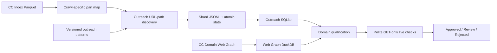

# Outreach discovery and donor qualification

Status: implementation plan
Scope: optional pipeline alongside the existing Common Crawl prospect collector
Production invariant: the running prospect collection, its database, checkpoints,
domain cap, scoring and default CLI behavior are not changed by this work.

## 1. Goal

Build a reproducible pipeline that:

1. finds pages inviting guest contributions or editorial outreach from the
   Common Crawl columnar index;
2. reduces the result to auditable domain-level prospects;
3. enriches shortlisted domains with Common Crawl Domain Web Graph signals;
4. performs a small, polite, read-only live qualification pass;
5. records both positive evidence and explicit rejection reasons.

This is a separate use case from the existing `prospect_pipeline.py`. The
existing collector looks for page families where links can appear, such as
forums, comments and wikis. An outreach page is an editorial invitation and
must not be inserted into the existing `candidates` table as if it were one of
those page families.

## 2. Current implementation versus the brief

| Brief assumption or request | Current repository | Decision |
| --- | --- | --- |
| Discovery only filters by TLD, HTTP status and MIME type | Adaptive discovery already applies URL footprints, precise/broad tiers, prefetch score, feedback priorities and per-domain caps | Reuse the streaming and checkpoint machinery, but do not reuse the existing prospect taxonomy |
| Add URL filtering | Filtering exists on `LOWER(url)` | Add outreach-specific filtering on `url_path` with segment-boundary semantics |
| Build a map from `url_surtkey` ranges to Parquet parts | No such map exists; parts are sampled or sharded by ordinal position | Add a conservative, crawl-specific part map |
| Save one row per domain | Existing tables are URL/page oriented | Preserve all matched pages for audit and maintain a separate best prospect row per registered domain |
| Limit to one or two pages per domain | Existing collection cap is ten | Add an independent outreach cap, default two; do not change the existing cap |
| Use the cc-index for competitor backlink intersections | The cc-index has page records, not a reverse domain link graph | Use the Common Crawl Domain Web Graph as a later stage |
| Use `n_hosts` as a PBN detector | `n_hosts` is not a calibrated PBN label | Treat it only as a weak anomaly or multi-tenant signal |
| Treat harmonic rank as a DR replacement | The values are not directly comparable | Store raw rank and a crawl-relative percentile; calibrate scoring on labelled data |
| Use sitemap `lastmod` as a hard activity signal | `lastmod` is optional and often unreliable | Use it as confidence-weighted evidence, never as the only rejection reason |
| A part map avoids all 300 parts | This is only true for a restricted SURT/TLD interval | Use it for targeted ccTLD runs; a genuinely global scan may still require every part |
| Current database can provide the required link graph | The default configuration does not retain full outgoing links, and outgoing links are not reverse backlink data | Keep Web Graph data in a separate analytical store |

## 3. Architecture



The first implementation PR covers the part map, URL-path discovery, storage
and pilot reporting. Web Graph ingestion and live qualification are separate,
gated stages. This keeps the first pilot measurable and prevents a failed
experimental path from affecting the production collector.

## 4. Proposed modules and artifacts

The planned additions are:

- `cc_links/partmap.py`: build, validate and query crawl-specific SURT ranges;
- `cc_links/outreach.py`: outreach pattern loading, URL-path matching, ranking
  and domain-level selection;
- `cc_links/outreach_db.py`: isolated SQLite schema and write/query helpers;
- `cc_links/outreach_webgraph.py`: optional Web Graph ingestion and joins;
- `cc_links/outreach_live.py`: optional polite live-site qualification;
- `cc_links/outreach_patterns.json`: versioned, reviewable pattern registry;
- `pipeline.py outreach ...`: optional CLI entry point;
- `sample_outreach.py`: deterministic manual-review sample;
- `analyze_outreach.py`: yield, noise, pattern, language and geo reports.

No new command becomes the default path.

## 5. Part map

### 5.1 Artifact

One immutable JSON file per crawl:

```json
{
  "schema_version": 1,
  "crawl": "CC-MAIN-YYYY-NN",
  "index_source": "https",
  "parts": [
    {
      "part": "part-00000-....c000.gz.parquet",
      "min_url_surtkey": "...",
      "max_url_surtkey": "...",
      "row_count": 0
    }
  ]
}
```

The artifact also carries a deterministic digest when referenced by a run
state. Timestamps may be recorded as metadata but must not participate in the
digest.

### 5.2 Selection rule

For a TLD prefix such as `co,`, calculate the lexicographic successor of the
prefix and use the half-open interval:

```text
[prefix, prefix_successor)
```

A part can be skipped only when its `[min_url_surtkey, max_url_surtkey]`
interval provably does not overlap any requested prefix interval. A part with
missing, malformed or unreadable metadata is included conservatively.

The implementation must not use an untested sentinel such as `"\xff"` as an
implicit universal upper bound.

### 5.3 Correctness tests

- prefix-successor unit tests;
- boundary overlap tests;
- null/malformed metadata tests;
- deterministic serialization and digest tests;
- pilot comparison showing that part-map pruning returns the same matching
  rows as an unpruned query over the same small set of files.

## 6. Outreach pattern registry

Patterns are data, not SQL literals embedded in Python:

```json
{
  "schema_version": 1,
  "patterns": [
    {
      "id": "en.write_for_us",
      "language": "en",
      "scope": "path_segment",
      "expressions": ["write-for-us", "write_for_us"],
      "weight": 100
    }
  ]
}
```

Required properties:

- globally unique and stable `id`;
- explicit language;
- explicit matching scope;
- stable weight used only for ranking matches inside the outreach pipeline;
- tests containing true and false examples.

Path-segment matching must check both the leading and trailing boundary.
`/write-for-us/`, `/write-for-us.html` and an exact final segment may match;
`/not-write-for-useless` must not.

The first registry should include English, Spanish and Portuguese patterns
needed for the pilot. Additional languages are added only with labelled
examples. Broad terms such as `blog`, `article` or `author` are not sufficient
on their own.

## 7. Discovery query and output

The query reads only required columns:

- `url`;
- `url_path`;
- `url_host_registered_domain`;
- `url_host_tld`;
- `content_languages`;
- `fetch_time`;
- `warc_filename`;
- `warc_record_offset`;
- `warc_record_length`;
- fields needed for HTTP status and MIME filtering.

It applies:

1. requested TLD interval/column filters;
2. successful fetch status;
3. HTML response MIME;
4. outreach path predicate;
5. existing global domain exclusions;
6. URL normalization and deduplication;
7. outreach-specific per-domain cap.

HTML and WARC fragments are not fetched during the URL-only pilot and are not
stored in the outreach database.

Each JSONL record includes at least:

```text
url
url_path
registered_domain
tld
language
crawl
fetch_time
pattern_id
pattern_weight
source_part
warc_filename
warc_record_offset
warc_record_length
```

## 8. Resume and checkpoint invariants

Each shard has a JSONL output and an atomic state file. The state identity
includes:

- schema version;
- crawl;
- index source;
- requested TLDs;
- selected parts and shard;
- pattern-registry digest;
- part-map digest;
- material query options.

Resume is refused when the identity changes. The user must start a new state
or explicitly migrate it.

A part is added to `completed_parts` only after:

1. its query completed successfully;
2. all returned records were flushed;
3. the output position and counters were saved;
4. the state file was atomically replaced.

Timeouts, throttling, malformed data and other failures are recorded with an
attempt count and last error category but never marked complete. Merging shards
is deterministic and idempotent.

## 9. SQLite schema

Use a separate database, for example `outreach.db`.

### 9.1 URL evidence

```sql
CREATE TABLE outreach_pages (
    url TEXT PRIMARY KEY,
    registered_domain TEXT NOT NULL,
    tld TEXT,
    language TEXT,
    crawl TEXT NOT NULL,
    fetch_time TEXT,
    pattern_id TEXT NOT NULL,
    pattern_weight INTEGER NOT NULL,
    source_part TEXT,
    warc_filename TEXT,
    warc_record_offset INTEGER,
    warc_record_length INTEGER,
    discovered_at TEXT NOT NULL
);
```

Indexes are required on `registered_domain`, `tld`, `language`, `pattern_id`
and `crawl`.

### 9.2 Domain prospect

```sql
CREATE TABLE outreach_prospects (
    registered_domain TEXT PRIMARY KEY,
    best_url TEXT NOT NULL,
    tld TEXT,
    language TEXT,
    best_pattern_id TEXT NOT NULL,
    first_crawl TEXT NOT NULL,
    last_crawl TEXT NOT NULL,
    discovery_score REAL NOT NULL,
    qualification_score REAL,
    status TEXT NOT NULL DEFAULT 'discovered',
    rejection_reason TEXT,
    updated_at TEXT NOT NULL
);
```

The best URL is selected deterministically by pattern weight, path specificity,
freshness and URL length. The child table remains the evidence trail.

Status values are:

- `discovered`;
- `review`;
- `approved`;
- `rejected`;
- `unreachable`.

Every terminal non-approved status requires a structured reason code.

## 10. Pilot and acceptance gate

Default pilot:

- one recent crawl;
- `co`, `mx` and `cl`;
- five to ten selected Parquet parts after part-map pruning;
- independent outreach cap of two pages per registered domain;
- no WARC fetch;
- no live forms or write requests.

The deterministic review CSV contains 50 URLs stratified by TLD, language and
pattern. Labels:

- `relevant`;
- `noise`;
- `uncertain`;

and a reason:

- false lexical match;
- generic editorial page;
- jobs/careers;
- login/account;
- dead/redirected;
- language mismatch;
- platform/mega-domain;
- other.

The full discovery stage is allowed only when:

- at least 40 of 50 rows are decisively labelled;
- `noise / (relevant + noise) < 0.20`;
- no single high-volume pattern has more than 30% noise;
- checkpoint/resume equivalence passes;
- per-domain cap and deterministic merge tests pass.

If the gate fails, patterns are changed and the pilot is repeated with a new
pattern digest and state directory.

## 11. Domain Web Graph stage

This stage starts only after URL discovery passes its quality gate and a
competitor-domain input is supplied.

Heavy graph data is stored in DuckDB, not in the collection SQLite database.
The graph run should use a separate volume or a separate worker so it cannot
exhaust disk space or contend with the active production collection.

Planned flow:

1. normalize competitor and discovered domains;
2. load the domain vertex map and ranks;
3. map competitor and candidate domains to vertex IDs;
4. stream the compressed edge list once;
5. retain only:
   - edges pointing to competitor IDs;
   - edges needed to count candidate in-degree;
6. aggregate competitor intersections and in-degree by candidate domain;
7. calculate crawl-relative rank percentiles;
8. export compact enrichment rows to the outreach database.

For a large target set, IDs are passed through a file/table or in-memory set,
not a shell command-line argument.

Proposed enrichment fields:

```text
graph_crawl
vertex_id
harmonic_rank
harmonic_rank_percentile
in_degree
n_hosts
competitor_intersection_count
competitor_intersections_json
```

No fixed threshold is described as equivalent to DR until it is calibrated on
labelled outcomes.

## 12. Live qualification stage

Live qualification is read-only and domain-oriented:

- respect robots rules;
- bounded global and per-domain concurrency;
- descriptive user agent;
- timeouts and capped retries;
- GET/HEAD only;
- never submit a form;
- never authenticate;
- never store full HTML;
- retain only extracted evidence and timestamps.

Potential evidence:

- current outreach page status and redirect target;
- homepage status;
- sitemap presence;
- recent sitemap dates with a confidence flag;
- contact/about/editorial page presence;
- visible CMS/engine signals;
- language consistency;
- obvious parked, expired or malware/interstitial signals.

Sitemap dates, CMS, IP/ASN concentration and `n_hosts` are weak signals. They
may contribute to scoring or manual review but cannot independently prove a
PBN.

Topic fit remains undefined until a target-topic taxonomy or seed keyword set
is supplied. The implementation must report it as unavailable rather than
inventing a score.

## 13. Scoring boundaries

Keep three scores separate:

1. `discovery_score`: confidence that the URL is a genuine outreach invitation;
2. `authority_score`: normalized Web Graph evidence;
3. `qualification_score`: current reachability, activity, contactability and
   risk evidence.

The final decision may combine them after calibration, but raw component
values and reason codes must remain queryable. A strong domain rank must not
turn a lexical false positive into an approved prospect.

## 14. Operational and security boundaries

- Work is developed on a dedicated feature branch and reviewed through a PR.
- The existing collector, release branch, production database and checkpoints
  are not modified by pilot runs.
- Runtime inputs and outputs live under a gitignored operations directory.
- Competitor lists, private taxonomies and live results are not committed.
- No IP addresses, hostnames, instance roles, credentials, tokens or private
  paths are committed.
- Access to S3 on a worker uses its runtime identity; no static keys are added.
- Parquet is read directly by DuckDB; it is not routed through a proxy.
- HTML bodies are processed in memory and discarded.

## 15. Delivery sequence

### PR 1: URL-only pilot

- part-map module and tests;
- pattern registry and tests;
- outreach discovery CLI;
- JSONL/state resume;
- outreach SQLite schema;
- sample and pilot reports;
- documentation.

### Gate 1

Manual 50-URL audit and less than 20% decisive noise.

### PR 2: Full discovery hardening

- multiple crawls;
- shard merge;
- presence/freshness aggregation;
- expanded patterns based on labelled errors;
- production-sized dry run on isolated storage.

### PR 3: Domain Web Graph

- DuckDB schema;
- vertex/rank ingestion;
- one-pass targeted edge aggregation;
- authority and competitor-intersection reports.

### PR 4: Live qualification

- polite crawler;
- structured evidence and reason codes;
- score calibration;
- approved/review/rejected exports.

## 16. Inputs needed after the first pilot

The URL-only pilot is not blocked by user input. Before the later stages, the
following are required:

1. competitor domains for backlink intersections;
2. target topics or seed keywords for topical fit;
3. preferred geographic priorities if they differ from the pilot TLDs;
4. labelled pilot CSV confirming or correcting the pattern taxonomy.
